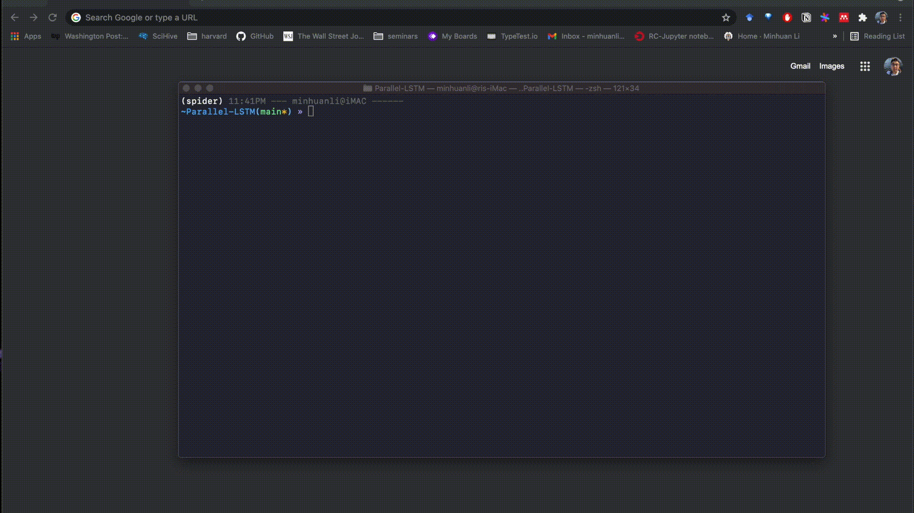
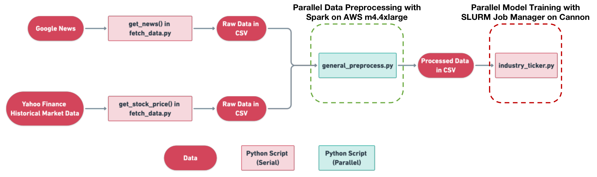

# The Application of Big Data and Big Compute in Stock Price Predictions
Team Members:Lihong Zhang, Minhuan Li, Yichen Geng, Tianlei He

Project Website: https://sites.google.com/g.harvard.edu/group6/home

## 1. How to use

For stock price prediction, our software can be simply used with following lines of codes:

Step 1: Clone this repo with: 
```
git clone -b main https://github.com/CS205-Project-S21/Parallel-LSTM.git
```

Step 2: Install related packages:
We recommend you to first create a virtual environment with [conda](https://docs.conda.io/en/latest/miniconda.html) and do this step in the virtual environment:
```
conda create -n stock_price python==3.8
conda activate stock_price
```
Then run:
```
pip install Pararrel-LSTM/requirements.txt
```


Step 3: Change into working directory and run command:
```
cd Pararrel-LSTM/utils
python price_predictor.py --ticker <stock-ticker>
```
You can replace the `<stock-ticker>` with one in the following list: `[BTC-USD, MARA, RIOT, COG, DVN, HFC]`. The software will present the prediction in great plots.



## 2. Project Introduction
This is a Big Data and Big Compute project to predict stock prices, and analyze how parallel computing improves the prediciton performance. 

There are many published models to predict stock prices, but the data processing and model training on time-series data take long time. Big Data and Big Compute are good methods to solve these issues. In this project, We predict future stock prices based on previous stock prices and google news by LSTM models, and improve the runtime performance by parallel data processing with Spark and parallel model training with GPU on Harvard Cannon.
## 3. Workflow

The workflow figure above contains 3 steps:
- Our data are composed of 2 parts, Google News and Yahoo Finance Historical Market Data. We fetched these data by the get_news() and get_stock_price() functions in fetch_data.py. 
- Then we process the raw data by general_preprocess.py. 
- Finally we train the LSTM models based on the processed data on Harvard Cannon. 
## 4. Directory structure

```
.
├── data: price and news data
│   ├── news
│   │   ├── data
│   │   │   ├── cryptocurrency: the google news that contain 'Bitcoin'
│   │   │   │   └── GoogleNews_Bitcoin_large_all.csv
│   │   │   └── energy: the google news that contain 'oil' and 'gas'
│   │   │       ├── GoogleNews_Energy_large_all.csv
│   │   │       └── GoogleNews_Energy_Mega_all.csv
│   │   └── scripts
│   │       ├── GetGoogleNews_Bitcoin_large.ipynb: produce GoogleNews_Bitcoin_large_all.csv
│   │       ├── GetGoogleNews_Energy_large.ipynb: produce GoogleNews_Energy_large_all.csv
│   │       └── GetGoogleNews_Energy_Mega.ipynb: produce GoogleNews_Energy_Mega_all.csv
│   ├── processed_data
│   │   ├── data
│   │   │   ├── processed_data_cryptocurrency.csv
│   │   │   ├── processed_data_cryptocurrency_15.csv
│   │   │   ├── processed_data_cryptocurrency_short.csv
│   │   │   ├── processed_data_energy.csv
│   │   │   ├── processed_data_energy_15.csv
│   │   │   ├── processed_data_energy_mega_15.csv
│   │   │   └── processed_data_energy_short.csv
│   │   ├── scripts
│   │   |   ├── general_preprocess.py
│   │   |   └── general_preprocess_twitter.py
│   |   └── readme.txt
│   ├── stock_price
│   │   ├── data
│   │   │   ├── cryptocurrency
│   │   │   │   ├── price_BTC.csv
│   │   │   │   ├── price_IXIC.csv
│   │   │   │   ├── price_MARA.csv
│   │   │   │   └── price_RIOT.csv
│   │   │   └── energy
│   │   │       ├── COG_large.csv
│   │   │       ├── DVN_large.csv
│   │   │       ├── HFC_large.csv
│   │   │       ├── price_COG.csv
│   │   │       ├── price_DVN.csv
│   │   │       ├── price_HFC.csv
│   │   │       └── price_IXIC.csv
│   │   └── scripts
│   │       └── download_historical_price.py
│   └── twitter
│       ├── data
│       │   ├── historical
│       │   │   ├── cryptocurrency
│       │   │   │   └── tweets.csv
│       │   │   └── energy
│       │   │       └── tweets.csv
│       │   └── streaming
│       │       ├── twitter_sentiment_scores_cryptocurrency.txt
│       │       ├── twitter_sentiment_scores_energy.txt
│       │       └── twitter_sentiment_scores_test_for_fun.txt
│       └── scripts
│           ├── combine_historical_tweets.py
│           ├── download_historical_tweets.py
│           ├── download_streaming_tweets.py
│           ├── process_streaming_tweets.py
│           └── visualize_streaming_tweets.py
├── model: the trained LSTM models ready for predicting
│   ├── lstm_2009_1
│   │   ├── energy_COG_2009_1.py
│   │   ├── energy_DVN_2009_1.py
│   │   └── energy_HFC_2009_1.py
│   ├── lstm_2009_5
│   │   ├── energy_COG_2009_5.py
│   │   ├── energy_DVN_2009_5.py
│   │   └── energy_HFC_2009_5.py
│   ├── lstm_2016_1
│   │   ├── crypto_BTC_2016_1.py
│   │   ├── crypto_MARA_2016_1.py
│   │   ├── crypto_RIOT_2016_1.py
│   │   ├── energy_COG_2016_1.py
│   │   ├── energy_DVN_2016_1.py
│   │   └── energy_HFC_2016_1.py
│   ├── lstm_2016_5
│   │   ├── crypto_BTC_2016_5.py
│   │   ├── crypto_MARA_2016_5.py
│   │   ├── crypto_RIOT_2016_5.py
│   │   ├── energy_COG_2016_5.py
│   │   ├── energy_DVN_2016_5.py
│   │   └── energy_HFC_2016_5.py
│   ├── model_saved
│   │   ├── cryptocurrency_BTC_2016_1.h5
│   │   ├── cryptocurrency_BTC_2016_5.h5
│   │   ├── cryptocurrency_MARA_2016_1.h5
│   │   ├── cryptocurrency_MARA_2016_5.h5
│   │   ├── cryptocurrency_RIOT_2016_1.h5
│   │   ├── cryptocurrency_RIOT_2016_5.h5
│   │   ├── energy_COG_2009_1.h5
│   │   ├── energy_COG_2009_5.h5
│   │   ├── energy_COG_2016_1.h5
│   │   ├── energy_cog_2016_5.h5
│   │   ├── energy_DVN_2009_1.h5
│   │   ├── energy_DVN_2009_5.h5
│   │   ├── energy_DVN_2016_1.h5
│   │   ├── energy_DVN_2016_5.h5
│   │   ├── energy_HFC_2009_1.h5
│   │   ├── energy_HFC_2009_5.h5
│   │   ├── energy_HFC_2016_1.h5
│   │   └── energy_HFC_2016_5.h5
│   ├── models_for_prediction
│   │   ├── BTC-USD.h5
│   │   ├── COG.h5
│   │   ├── DVN.h5
│   │   ├── HFC.h5
│   │   ├── MARA.h5
│   │   └── RIOT.h5
│   ├── readme.txt
│   └── short
│       ├── LSTM_energy_COG_short.py
│       └── LSTM_energy_short.ipynb
├── utils: utility codes for fetching data
│   ├── fetch_context_web.py
│   ├── fetch_data.py
│   ├── fetch_google_news.py
│   └── price_predictor.py
├── playground: various attemps of data processing and modelling
├── docs: documentation of the software
├── README.md
├── .gitignore
└── requirements.txt
```


## 5. Preprocessing of Data
### 5.1 Raw Data
The raw data are stored in data/stock_price/data/ and data/news/data/ directories.
### 5.2 Preprocessed Data
The preprocessed data are stored in the data/processed_data/data directory.

For detailed explanations of our data types, sources and data preprocessing techniques, please refer to our website https://sites.google.com/g.harvard.edu/group6/home.
## 6. LSTM models
LSTM models are popular time-series models used to predict stock prices. We built LSTM models based on a publication [DP-LSTM: Differential Privacy-inspired LSTM for Stock Prediction Using Financial News](https://arxiv.org/pdf/1912.10806v1.pdf).
### 6.1 Comparison of Models based on Different Datasets
The improvements on LSTM model training by parallel computing may be different for stock prices in different industries. To test the scalability of the parallel computing in model training, we build and train LSTM models with the following datasets of 2 different industries and time ranges.
- Industry: 
  - cryptocurrency: BTC-USD, MARA, RIOT
  - energy: COG, DVN, HFC
- Historical market data: 
  - cryptocurrency: year 2016-2021
  - energy: year 2009-2021

The models are stored in the model directory using the naming convention lstm_the earliest year of data_# of prediction days, e.g., lstm_2009_5 contains the LSTM models to predict 5 days' prices based on data from 2009 to 2021, and other subfolders follow the same naming method.
In each subfolder, one python file builds and trains one LSTM model, and the python files are named by (industry)_(stock)_(data starting year)_(# of prediction days). For example, energy_HFC_2009_5.py returns an LSTM model which predict 5 days' prices based on data from 2009 to 2021.

### 6.2 Model Training by cuDNN and GPU 
In general, LSTM training is sequential, which takes long time. We apply CUDA Deep Neural Network (cuDNN) and GPU to LSTM training and get practical speedup = 3 compared to CPU training.

## 7. Working specs

### 7.1 Specs for the parallel computing of preprocessing data 
For multi-core test, we use the AWS EC2: Ubuntu 18.04, m4.4xlarge(16vcpus + 64GiB memory)

For multi-instance test, we use AWS EMR: emr-6.3.0: Spark 3.1.1 on Hadoop 3.2.1 with 1-8 core instances (m4.xlarge)

Latency: rtt min/avg/max/mdev = 0.311/0.339/0.363/0.021 ms 

Bandwidth: 
	Interval: 0.0-10.0sec, Transfer: 1.22GBytes, Bandwidth: 1.05Gbits/sec

More detailed information can be found in data/processed_data/readme.txt

### 7.2 Specs for training LSTM models in parallel
Harvard Cluster seas_dgx1 partition
CPU: Intel(R) Xeon(R) CPU E5-2698 v4 @ 2.20GHz
GPU: Tesla V100-SXM2-16GB
More detailed information can be found in model/readme.txt


